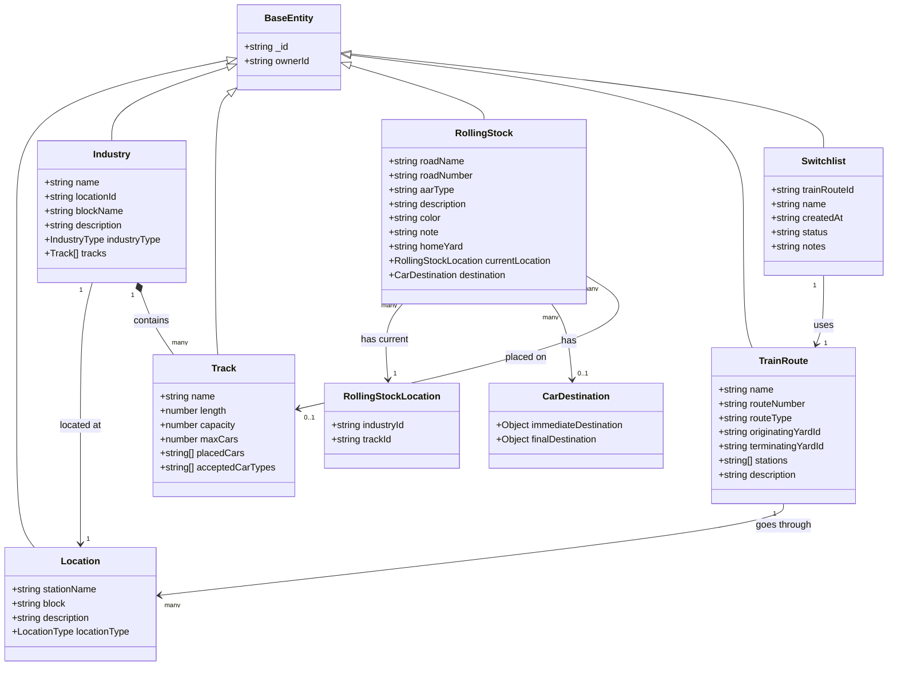

# Switch This: Model Railroad Switchlist Generator

[](https://github.com/MyTurnyet/switch-this/actions/workflows/run-tests.yml)
[](https://github.com/MyTurnyet/switch-this/actions/workflows/run-tests.yml)

A modern web application for generating and managing switchlists for model railroad operations, built with Next.js, TypeScript, and a rich UI.

## Overview

Switch This is a sophisticated web-based tool designed to help model railroaders create and manage switchlists efficiently. The application provides a clean, intuitive interface for organizing and tracking rolling stock, industries, and train routes across different locations on a model railroad layout. It eliminates the need for spreadsheets or paper-based methods in managing operational sessions.

## What are Switchlists?

In model railroading, switchlists are documents that tell operators which rail cars need to be picked up or dropped off at various industries on the layout. They simulate the paperwork that real railroads use to manage freight operations, adding realism and purpose to operating sessions.

## Features

- **Industry Management**: Create, edit, and organize industries at various locations
- **Location Tracking**: Manage stations and blocks across your railroad layout
- **Rolling Stock Inventory**: Track all your rail cars with details including road name, road number, and AAR type
- **Train Routes**: Define freight routes between yards with intermediate station stops
- **Layout State Management**: View and modify the current state of your entire layout
- **Responsive Design**: Works seamlessly on desktop and mobile devices
- **MongoDB Integration**: Persistent storage of all railroad data

## Tech Stack

- [Next.js](https://nextjs.org) - React framework with App Router
- [TypeScript](https://www.typescriptlang.org) - Type-safe JavaScript
- [Material-UI](https://mui.com) - React UI components
- [Tailwind CSS](https://tailwindcss.com) - Utility-first CSS framework
- [MongoDB](https://www.mongodb.com) - NoSQL database for data storage
- [Jest](https://jestjs.io) - Testing framework
- [React Testing Library](https://testing-library.com/docs/react-testing-library/intro/) - Testing utilities

## Getting Started

### Prerequisites

- Node.js 18.0 or later
- npm or yarn package manager
- MongoDB (local instance or remote connection)
- Docker and Docker Compose (optional, for containerized setup)

### Installation

1. Clone the repository:
```bash
git clone [repository-url]
cd switch-this
```

2. Install dependencies:
```bash
npm install
# or
yarn install
```

3. Set up environment variables:
Create a `.env` file based on the provided example and configure your MongoDB connection details.

### Environment Variables

Your `.env` file should include the following variables:

```
# MongoDB Connection
MONGODB_URI=mongodb://localhost:27017/switch-this
MONGODB_DB=switch-this

# API Configuration
API_URL=http://localhost:3000/api
NEXT_PUBLIC_API_URL=http://localhost:3000/api

# Authentication (if implemented)
JWT_SECRET=your-jwt-secret-key
JWT_EXPIRY=7d

# Development Settings
NODE_ENV=development
```

4. Start the MongoDB container (if using Docker):
```bash
docker-compose up -d
```

5. Seed the database (optional):
```bash
npm run seed
# or 
yarn seed
```

6. Run the development server:
```bash
npm run dev
# or
yarn dev
```

7. Open [http://localhost:3000](http://localhost:3000) in your browser to see the application.

## Development

The project follows a component-based architecture with a focus on:
- Clean, maintainable code through TDD (Test-Driven Development)
- Type safety with TypeScript
- Responsive design principles
- Strict adherence to XP (Extreme Programming) practices

### Project Structure

- `src/` - Source code
  - `app/` - Main application code (Next.js App Router)
    - `api/` - API routes for industries, locations, rolling stock, and train routes
    - `components/` - Reusable UI components
    - `industries/` - Industry management pages
    - `layout-state/` - Layout state management functionality
    - `rolling-stock/` - Rolling stock management
    - `train-routes/` - Train route management
    - `shared/` - Shared components, hooks, contexts, and services
    - `styles/` - Global styles
  - `data/` - Sample data for development
  - `lib/` - Core utilities, services, and constants
  - `test/` - Test utilities and integration tests
- `docker/` - Docker configuration for development

### UML Class Diagram

Below is a UML diagram representing the core entities and their relationships in the Switch This application:



## Testing

The project uses Jest and React Testing Library for testing. Run tests with:

```bash
npm test
# or
yarn test
```

For test coverage:

```bash
npm run test:coverage
# or
yarn test:coverage
```

## Contributing

Contributions are welcome! Please follow the TDD approach and adhere to the Arlo Belshee git commit notation for all contributions.

## License

[Add your license information here]